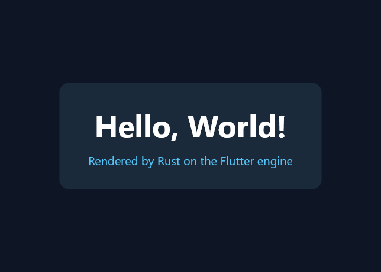

# 搬迁状态与待办清单

上游：`K:\flutter\engine\src`（commit `cf97bfbcb9f`）
搬迁时间：2026-08-14 ｜ 已拷入 2,967 个 C/C++ 文件 / 约 569,000 行 / 49 MB

---

## 一、已拷入的内容

### Tier A — 原样保留，零改动

对 Dart 的引用数为 0（`assets`、`common` 各有 1 个头文件例外，见 Tier B）。

| 目录 | 文件 | 行数 | 作用 |
|---|---:|---:|---|
| `impeller/` | 925 | 169,832 | GPU 渲染后端 |
| `display_list/` | 171 | 44,842 | 绘制指令录制与回放 |
| `flow/` | 123 | 22,373 | Layer 树、合成、raster cache |
| `txt/` | 51 | 3,633 | 文字排版（依赖 skparagraph） |
| `vulkan/` | 34 | 3,450 | Vulkan 封装 |
| `flutter_vma/` | 4 | 398 | Vulkan 内存分配器 |
| `shell/gpu/`, `shell/version/` | — | — | GPU surface 与版本信息 |
| `build/`, `testing/` | 114 | 9,680 | GN 辅助与测试框架 |
| `src/build/`, `src/build_overrides/`, `src/.gn`, `src/BUILD.gn` | — | — | GN 构建系统 |

### Tier B — 已拷入，少量文件待改

`shell/` 共 1,150 文件 / 264,992 行，`fml/` 198 文件 / 18,883 行。
**其中仅 10 个非测试文件引用 Dart：**

| 文件 | 需要做什么 |
|---|---|
| `shell/common/engine.cc` / `engine.h` | **核心改造点。** `Engine` 实现 `RuntimeDelegate`，持有 `RuntimeController`。需抽出接口，让 Rust 运行时替代 Dart 运行时 |
| `shell/common/shell.cc` | 去掉 `DartVM` 启动与生命周期管理 |
| `shell/common/animator.cc` | vsync → `BeginFrame`/`DrawFrame` 的时序，需改为驱动 Rust 侧 |
| `shell/platform/embedder/embedder.cc` | embedder C API 中的 Dart entrypoint 参数需替换 |
| `fml/trace_event.cc` / `.h` | 仅用 Dart Timeline API 记录 trace，换成独立实现即可 |
| `common/settings.h` | 配置结构体中的 Dart 相关字段 |
| `assets/native_assets.h` | native assets 清单，与 Dart FFI 绑定相关 |
| `shell/profiling/sampling_profiler.cc` | 采样 profiler 的 Dart 集成 |
| `BUILD.gn`（根） | 移除 Dart 相关 target |

`shell/platform/` 的各平台嵌入层（Android / darwin / linux / windows / common）
共 768 个文件，**仅 macOS 的 2 个测试辅助文件引用 Dart，96% 以上无需改动**。

`tools/` 保留了上游的构建工具（`engine_tool`、`clang_tidy`、`githooks` 等，共 168 个
`.dart` 文件）。这些是**构建期主机工具，不进产物**，短期可继续用 Dart 跑，无需优先替换。

### Tier C — `lib/ui/`：已拷入 C++，待去 Dart 化

149 个文件 / 23,061 行，**其中 73 个文件需要改造**。20 个 `.dart` 文件已丢弃。

> ⚠️ **修正一处此前的判断。** 我先前说这一层"只需把外层的 tonic 绑定换成 `extern "C"`"，
> 这低估了工作量。实际耦合是结构性的：88 处继承 `RefCountedDartWrappable<T>` /
> 使用 `DEFINE_WRAPPERTYPEINFO()` / 在构造函数签名里接收 `Dart_Handle`。例如
> `lib/ui/painting/path.h`：
>
> ```cpp
> class CanvasPath : public RefCountedDartWrappable<CanvasPath> {
>   DEFINE_WRAPPERTYPEINFO();
>   static fml::RefPtr<CanvasPath> Create(Dart_Handle wrapper) {
>     auto res = fml::MakeRefCounted<CanvasPath>();
>     res->AssociateWithDartWrapper(wrapper);   // ← Dart GC 挂钩
>     ...
> ```
>
> 好消息是**载荷逻辑是干净的**——`CanvasPath` 实际只持有一个 `SkPath sk_path_`，
> 方法体全是普通 C++。所以这是一次跨 73 个文件的**机械式去包装**
> （剥离基类、`Dart_Handle` 构造参数换成普通工厂、引用计数改由 Rust 侧 `Arc` 持有），
> 而不是重写。工作量可预估，但不是"改个绑定层"那么轻。

按子目录：

| 子目录 | 行数 | 内容 |
|---|---:|---|
| `lib/ui/painting/` | 10,650 | Canvas / Path / Paint / Gradient / ImageFilter / Picture / Codec / Vertices |
| `lib/ui/window/` | 3,297 | `PlatformConfiguration`（20 个入向回调所在地） |
| `lib/ui/text/` | 1,410 | ParagraphBuilder / Paragraph / FontCollection |
| `lib/ui/semantics/` | 941 | SemanticsUpdateBuilder |
| `lib/ui/compositing/` | 657 | **SceneBuilder / Scene —— 产出 `LayerTree` 的地方，M1 的目标** |

保留 `lib/ui/dart_ui.cc` 未删除：它是那 231 个绑定的完整清单，
是 Rust FFI 层要实现什么的**权威规格书**，改造完成后再删。

---

## 二、未拷入的内容

| 内容 | 规模 | 原因 |
|---|---:|---|
| `third_party/` 全部 | 13 GB | 上游未修改，应由 DEPS/gclient 拉取。含 skia 1.2G、icu 1.2G、harfbuzz 223M 等 |
| └ `third_party/dart` | 4.0 GB | **Dart SDK，本项目彻底不需要** |
| └ `third_party/tonic` | — | Dart↔C++ 胶水，随 Dart 一起消失 |
| `runtime/` | 9,248 行 | DartVM / DartIsolate / DartSnapshot / service isolate，整个目录删除 |
| `lib/ui/*.dart` | 27,437 行 | `dart:ui` 的 Dart 侧，由 Rust 重写 |
| `lib/web_ui/` | 186,995 行 | Web 引擎（Dart 实现），本阶段不涉及 |
| `lib/io/`, `lib/snapshot/`, `lib/gpu/` | — | dart:io 钩子 / Dart 快照 / dart:gpu |
| `shell/platform/fuchsia/` | — | 本质是一个 Dart runner 宿主 |
| `testing/dart/` | — | `dart:ui` 的测试套件 |
| `sky/`, `web_sdk/`, `skwasm/`, `wasm/` | — | Dart 包定义与 Web 产物 |
| `flutter_frontend_server/` | — | Dart kernel 编译器前端 |
| `out/` | 9.3 GB | 构建产物 |
| `packages/`（框架 63 万行） | — | 由 Rust 重写，不作为参考拷入 |

已拷入后又移除的纯 Dart 运行时插件：`lib/ui/isolate_name_server/`、`lib/ui/plugins/`、
`window/platform_isolate.*`、`window/platform_message_response_dart*.`、
`shell/platform/common/isolate_scope.*`、`shell/common/dart_native_benchmarks.cc`。

---

## 三、M0 —— 已完成 ✅

目标是让这棵树能编译，并接入 Rust 工具链。四项全部达成，Windows x64 host 构建实测通过。

### 1. 依赖裁剪

`DEPS` 由 `tools/gen_deps.py` 从上游过滤生成，保留条目的 revision 与上游一致，便于后续 roll：

| | 上游 | rustflutter |
|---|---:|---:|
| vars | 105 | 48 |
| deps | 118 | 66 |
| hooks | 14 | 6 |

丢弃的 52 个 deps：Dart SDK 30、Dart pub 包 10、web 工具链 5、Dart SDK 的 C 依赖 4
（cpu_features / re2 / sqlite / ai）、Fuchsia 3。保留 boringssl——它不是 Dart 依赖，
`common/graphics/persistent_cache` 用它算 shader 缓存键。

路径按本树布局重写：上游 checkout 根下是 `engine/src/flutter`，这里是 `src/flutter`，
少一层 `engine/`。deps 的 key 和 hooks 的 action 都要改，否则这份文件描述的是一棵
不存在的树，CI 或空目录里的 `gclient sync` 会把依赖拉到错的地方。

**本地不执行 `gclient sync`**：13 GB 依赖用目录 junction 指向已有的
`K:\flutter\engine\src`，零下载、零额外磁盘。

代价是 `DEPS` 只是描述，不产生任何东西——**构建实际链接的是 junction 指向的那个
revision，不是这里写的那个**，而两者会无声地分开。`gclient sync` 了上游却没重新生成
`DEPS`，就是升级流程必经的那一步。`tools/check_deps.py` 就是用来抓这个的：逐条把
`DEPS` 的 revision 和 junction 目标的 `HEAD` 对上，对不上就非零退出。

实测 45 条 git 依赖：43 条一致，2 条声明了但没建 junction（`ocmock` 只被 darwin 的
BUILD.gn 引用，`gtest-parallel` 只被 `testing/run_tests.py` 用，Windows 上都不构建，
所以只报告不失败）。21 条 CIPD 包没有 git revision 可比，跳过。

比较要把 revision 剥到 commit（`^{commit}`）：`DEPS` 里 harfbuzz 钉的是附注标签
13.2.1 的**标签对象**，不是它指向的提交，直接比字符串会报一个并不存在的漂移。

### 2. GN 去 Dart 化

实测共 **62 条依赖边 / 19 个 BUILD.gn** 指向已删除的 Dart 目标，已全部清除。
另有若干处需要真实改造而非删除：

| 位置 | 处理 |
|---|---|
| `fml/trace_event.{h,cc}` | **只用了 `Dart_Timeline_Event_Type` 这个枚举，一个 Dart 函数都没调**。就地声明等价枚举（成员与顺序照搬，保证下游 Chrome-trace phase 字符不变），`display_list` 和 `flow` 对 `libdart_jit` 的链接边随之消失 |
| `testing/testing.gni` | 摘掉 3 个 Dart 快照模板与 `test_fixtures` 的 `dart_main` 分支；fixtures 定位 / 拷贝 / `enable_unittests` 原样保留 |
| `testing/BUILD.gn` | 删除 `source_set("dart")`、vmservice 快照、`fixture_test`（及对应 10 个源文件） |
| `runtime:test_font` | **抢救**——字体数据本身零 Dart 耦合，移到 `//flutter/test_font`，txt 的测试依赖它 |
| `shell/version` | 删除 `GetDartVersion()` 与 `DART_VERSION` define |
| `testing/testing.cc` | 删除 `GetDefaultKernelFilePath()`（返回 Dart kernel_blob.bin 路径） |
| `tools/gn` | 补 `strip_dart_args()` 过滤所有 `dart_*` GN 参数；`content_hash` 在缺少 monorepo 脚本时回落到 engine revision |
| ANGLE 的 `gclient_args.gni` | ANGLE 硬编码 import 了 Dart SDK 里的这个生成文件。在 GN **secondary source 树**里放了 shim，从而既不需要 `third_party/dart` 目录存在，也不必给 ANGLE 打补丁 |
| `lib/ui/BUILD.gn` | 桩化为空 group（原文件存为 `BUILD.gn.upstream`），使 `//flutter/lib/ui` 标签可解析而不把不可编译的源码拖进图 |

### 3. Tier A 构建通过

```
gn gen  →  985 targets from 264 files
ninja   →  2581/2581,  exit 0
```

产出 2,874 个编译单元，全树无任何 Dart 产物。

### 4. Rust 工具链已接入

- `src/build/toolchain/rust.gni`：`rustc_path` / `rust_edition` / `extra_rustflags` 三个 build arg
- `src/build/toolchain/win/BUILD.gn`：新增 `rust_rlib` / `rust_staticlib` / `rust_bin` 三个 GN tool
  （注意本仓库 pin 的 GN 是 2285，不支持 rust tool 上的 `depsformat` 与 `*_output_extension`，
  输出扩展名直接写死在 `outputs` 里）
- `flutter/rust/ffi`：Rust staticlib，导出 `extern "C"` 符号
- `flutter/rust:rust_ffi_unittests`：C++ 侧调用 Rust 并断言返回值

```
[1/1] RUST(STATICLIB) obj/flutter/rust/ffi.lib
[  PASSED  ] 2 tests.
```

**Rust ↔ C++ 边界已实测打通。**

> 当前 `rustc_path` 默认走 PATH（本机 rustc 1.93.0，edition 2024）。进 CI 前应像 clang 一样
> 用 CIPD 固定到 `//flutter/buildtools/$host_os-$host_cpu/rust`，保证构建可复现。
> 目前只写了 Windows toolchain 的 rust tool，mac/linux/android 需照做。

---

## 四、M1 —— 已完成 ✅

目标是 Dart-free 地出一帧。实际做到的比原计划多：不只出了帧，还有可用的 widget 层、
项目脚手架和窗口显示。

### 1. 引擎边界（`flutter/rust/ffi/`）

`rustflutter_ffi.h` / `.cc` 是一层 `extern "C"` ABI，覆盖 Paint / Canvas
（`DisplayListBuilder`）/ Paragraph（`txt` + skparagraph）/ LayerTree / 光栅化。
它只是包装引擎已有的 C++ 对象，`display_list`、`flow`、`txt` 一行未改。

出帧路径：

```
Rust widget 树
  → DisplayListBuilder            (display_list, 原样)
  → DisplayListLayer → LayerTree  (flow, 原样)
  → LayerTree::Flatten()          (flow, 原样)
  → SkSurface raster              (skia, 原样)
  → PNG / BGRA 缓冲
```

`LayerTree::Flatten()` 不需要 GPU 上下文，所以无头渲染开箱可用。
Impeller 是生产路径，但它需要 Shell，而 Shell 还卡在 Engine/RuntimeController 改造上。

### 2. 框架 crate（`flutter/rust/rustflutter/`）

- `engine.rs` —— FFI 的安全封装。每个句柄由 Rust 值持有并 `Drop`，
  取代上游 `RefCountedDartWrappable` + Dart GC 的不确定回收。
- `widgets.rs` —— widget 层：`Constraints` / `Size` / `Offset` / `EdgeInsets`，
  以及 `Text` / `Container` / `Center` / `Column`。布局协议与上游 `RenderBox` 一致：
  **约束下行、尺寸上行、父级定位子级**。
- `lib.rs` —— `App`，跑一帧：layout → paint → `LayerTree` → 交给引擎。
  对应上游 `RenderView` + `SchedulerBinding.drawFrame` 到 `PlatformDispatcher.render()`。

### 3. 项目脚手架（`flutter/rust/cli/`）

```sh
rustflutter create <name> [--title <text>]   # 生成项目
rustflutter list                             # 列出项目
rustflutter build <name>                     # ninja 构建
rustflutter run <name> [-- <app args>]       # 构建并运行
```

`create` 写出 `BUILD.gn` / `main.cc` / `src/main.rs` / `README.md`，
并重写 `projects/BUILD.gn` 把新项目接进构建图。生成后需要跑一次 `gn gen`
让 GN 发现新目录。

### 4. 窗口显示（`flutter/rust/ffi/rustflutter_window_win.cc`）

Win32 窗口 + `StretchDIBits` 直接呈现 BGRA 缓冲。**这是权宜方案**，
不是生产路径——生产路径是 `shell/platform/windows` 驱动 Impeller，
仍然依赖 Engine/RuntimeController 改造。非 Windows 平台目前返回 `-100`。

### 5. 验证

| | 结果 |
|---|---|
| `gn gen` | 998 targets / 270 files |
| `ninja flutter:tier_a` | 2581/2581, exit 0 |
| `rustflutter_unittests`（Rust） | 7 passed |
| `rust_ffi_unittests`（C++ 集成） | 5 passed |
| `rustflutter create` → `run` | 生成项目构建通过并出帧 |
| 窗口显示 | 800x600 客户区截图与预期一致 |

FFI 集成测试不是烟雾测试：它构造 LayerTree、经引擎光栅化、再读回像素断言颜色，
并断言文字确实在表面上留下了墨迹。

### M1 期间修正的三个判断

1. **`SkPngEncoder::Encode` 的签名**与记忆中不同——这个 Skia 版本里
   `SkWStream*` 重载只接受 `SkPixmap`，用的是 `Encode(GrDirectContext*, SkImage*, Options)`
   （CPU 图像传 nullptr 上下文）。
2. **`txt::FontWeight` 是直接的 CSS 数值**（400 = normal），不是 0 基索引。
   我最初按索引映射，把 700 变成了 6，渲染出极细体。已改为透传。
3. **`Paragraph` 需要两趟排版**。第一趟在给定的 `max_width` 里量出墨迹宽度，
   第二趟按该宽度收紧段落盒。否则居中/右对齐的段落是相对 `max_width` 定位字形的，
   与调用方量到的盒子对不上——上游 `RenderParagraph` 在松约束下也是这么做的。

### 已知限制

- **GN 的 `rust_bin` 工具没有使用。** 让 rustc 主导最终链接，在 Windows 上要重新推导
  MSVC 链接器路径和系统库列表（而且 rustc 会给 GN 已带 `.lib` 后缀的库名再加一次
  `.lib`）。应用和 CLI 一律用 Rust staticlib + 三行 C++ shim 的模式，
  既绕开这些问题，也是应用本来就需要的（它们要链接 C++ 引擎）。
  Rust 单测则通过 `run_rust_tests.py` 显式指定 `lld-link` 来构建运行。
- Rust 工具链目前只在 Windows toolchain 里声明；mac/linux/android 需照做。
- 窗口层只有 Windows 实现，且是静态一帧，没有事件循环与重绘驱动。（M2 已解决）

---

## 五、M2 —— 已完成 ✅

接管 `shell/common` 的 Engine / RuntimeController。这一步的价值不在代码量，
而在它**一次解锁四样东西**：真正的 vsync 帧调度、引擎自己的线程模型、
`Rasterizer` 流水线、以及平台嵌入层的接入点。

### 1. `lib/ui` 拆成两个目标（M2.1）

`lib/ui:ui_types` —— shell 需要的那部分，全部是普通 C++：
viewport metrics、pointer/key packet、platform message、semantics node、
font collection、image generator registry。实测 shell 依赖的 10 个头文件里
9 个对 Dart 的引用数为 0，只有 5 个文件需要动刀：

| 文件 | 改动 |
|---|---|
| `semantics/string_attribute.{h,cc}` | 删掉 `NativeStringAttribute`（纯 Dart peer 类），改为普通构造函数；.cc 删除 |
| `semantics/semantics_flags.{h,cc}` | 删掉 `NativeSemanticsFlags`；.cc 删除 |
| `semantics/custom_accessibility_action.h` | 去掉 3 个 tonic include |
| `text/font_collection.{h,cc}` | `LoadFontFromList(Dart_Handle, Dart_Handle, ...)` → `LoadFontFromBuffer(const uint8_t*, size_t, ...)` |

`lib/ui:ui` 仍是空 group——73 个 `RefCountedDartWrappable` 包装类是 M4 的活。

### 2. `//flutter/runtime` 重建（M2.2）

上游这个目录是 Dart VM 嵌入层（DartVM / DartIsolate / DartSnapshot /
IsolateConfiguration / service isolate / tonic），导入时整个删掉了。
现在回来的只有 shell 真正需要的部分：

- `runtime_delegate.h` —— 上游的契约减去四个 Dart VM 专有成员
  （`OnRootIsolateCreated`、`UpdateIsolateDescription`、`RequestDartDeferredLibrary`，
  以及随之而去的 `dart_api.h`）。**最要紧的那一个成员原样保留**：
  `Render(int64_t view_id, std::unique_ptr<LayerTree>, float dpr)`。
- `runtime_controller.{h,cc}` —— 持有一个 `RfApp`（静态链接的 Rust 框架实例）
  而不是 root isolate，通过 `rf_app_*` C ABI 而不是 20 个
  `tonic::DartPersistentValue` 回调与框架通信。**调用方向和时序完全不变**，
  这正是 Engine / Animator / Rasterizer / 各嵌入层能原样不动的原因。
- `platform_data.{h,cc}` —— 从上游原样拷回。

Rust 侧 `rustflutter/src/app.rs` 实现 `rf_app_*`：视图管理、begin/draw frame、
每个视图一次 `render` 回调交出 layer tree。应用实现 `Application` trait，
用 `register_application` 在**运行期**注册。

> 这里改过一次设计。最初让应用通过 `app!` 宏导出一个 `#[no_mangle]` 符号，
> 由链接期解析——结果是每个链接了框架却没有应用的二进制（单测、CLI 工具）
> 都链不上。改成运行期注册后，框架回到"一个普通库"的位置。

### 3. `shell/common` 去 Dart 化（M2.3）

| 文件 | 行数 | 主要改动 |
|---|---|---|
| `engine.{h,cc}` | 692 → 499 | 构造函数不再穿 DartVM / isolate snapshot / SkiaUnrefQueue / SnapshotDelegate / `UIDartState::Context`；`Run()` 调 `LaunchApplication` 而非 `LaunchRootIsolate`；`Restart()` 用自己的 `PlatformData` 重建控制器而不是 clone isolate |
| `shell.{h,cc}` | 2527 → 1881 | 去掉 `DartVMRef`，去掉整个 VM service protocol（Shell 曾是 `ServiceProtocol::Handler`，11 个端点全部注册在 VM 上）；`GetConcurrentWorkerTaskRunner` 自己持有线程池；`Shell::Spawn` 明确失败——spawn 共享的是 isolate group，这里没有这种东西 |
| `animator.cc` | — | `Dart_TimelineGetMicros()` → `fml::TimePoint::Now()`（同一个时钟） |
| `run_configuration.{h,cc}` | — | 去掉 `IsolateConfiguration`：没有快照要加载，所以配置恒为 valid |
| `platform_view.{h,cc}` | — | 删掉 deferred-library 钩子 |
| `switches.cc` | — | `--dart-flags` 接受并忽略，不再对着 allow-list 检查 |
| `shell/profiling/sampling_profiler.cc` | — | 不再给一个不存在的 service 命名线程 |

### 4. 真正的 Shell 跑起来（M2.4）

新增 `//flutter/rust/host` —— 上游由 `shell/platform/<os>` 承担的角色，
但小得多：没有 platform channel、没有 plugin registrar、没有 embedder C API，
只有一个窗口、线程模型和 shell。（平台通道后来补上了，见第十五节。）

```
主线程     Win32 窗口 + 消息循环（窗口消息只投递给创建它的线程）
platform   Shell 生命周期、PlatformView
ui         Animator → Engine → RuntimeController → Rust
raster     Rasterizer → GPUSurfaceSoftware → 帧缓冲
io         ShellIOManager
```

窗口线程刻意**不是** platform 线程：让它兼任意味着要把 `fml::MessageLoop`
和 `GetMessage` 交错起来，那是 Windows 嵌入层花掉真实复杂度的地方。
窗口学到的（尺寸、关闭）投递给 platform task runner；
raster 线程产出的帧用 `PostMessage` 投回窗口线程，两边不直接碰对方的状态。

**验证**：

```
帧率       175 帧 / 2.917 秒 = 60.0 fps，帧间隔精确 16,666 µs
像素       #0E1626（背景）/ #1B2A3A（卡片），与 headless PNG 一致
重排       系统把窗口缩到 644×461 后自动重新布局
           → WM_SIZE → SetViewportMetrics → ScheduleFrame → build → render 全通
构建       ninja 全绿，7 个 Rust 单测 + 5 个 FFI 单测通过
脚手架     rustflutter create → gn → run 全流程可用，生成的应用同样跑在 Shell 上
```



### M2.5 Impeller —— 已完成 ✅（见第十二节）

### M2 已知限制（当时）

- 呈现是软件光栅（M2.5 已解决）。
- 指针事件已接到 pointer 入口，但没有可命中测试的渲染树可路由（M3/M5 已解决）。
- 平台通道、语义、deferred loading 在 `RuntimeController` 里都是接受即返回。
- host 只有 Windows 实现；`rf_host_run` 之上的一切（Shell、ThreadHost、
  Animator、Rasterizer、软件 surface）都是可移植的，每个平台缺的只是
  一个窗口和一个消息循环。

---

## 六、M4 —— 已完成 ✅

补齐 dart:ui 等价层。引擎 C ABI 从 29 个函数长到 78 个：

| 类别 | 内容 |
|---|---|
| paint | 不透明度、混合模式、线帽/线接、遮罩模糊，线性/径向/扫描渐变 |
| path | 命令式构建器（move/line/quadratic/cubic/close）+ 矩形/椭圆/圆/圆角矩形 |
| canvas | line、oval、path、arc、image、image_rect；save/saveLayer/restore + save count；translate/scale/rotate/skew/2D 仿射；裁剪矩形、圆角矩形、路径 |
| layers | transform、offset、clip rect/rrect/path、opacity、背景模糊、子树模糊，以 push/pop 栈的形式覆盖 flow 的各 Layer 类型 |
| images | 解码 PNG/JPEG/WebP/GIF/BMP 并绘制 |

**这里做了一个明确的取舍**：没有去 Dart 化 `lib/ui/painting` 里那 73 个
`RefCountedDartWrappable` 类。它们存在的意义就是被 Dart 调用，每个的实际载荷
不过是 display_list 之上的几行。直接从 C ABI 触达 display_list 得到同样的能力，
而不必背上一个没有调用者的绑定层。

`RfLayerTree` 从单一 root 改为持有一个打开中的容器层栈，push/pop 因此与
`SceneBuilder.push*` 语义一致。

Skia 编解码器注册移进了 `rf_image_decode`：本构建定义了
`SK_DISABLE_LEGACY_INIT_DECODERS`，而解码必须在没有 shell 的情况下也能工作。

---

## 七、M5 —— 已完成 ✅

渲染层。`render.rs` 完整实现 RenderBox 协议——**约束下行、尺寸上行、父级定位子级**
——外加 intrinsics、基线和命中测试：

```
RenderDecoratedBox     纯色/渐变填充、圆角、描边
RenderParagraph        文本，含真实基线与固有宽度
RenderImage            Contain / Cover / Fill / None
RenderConstrainedBox   SizedBox 与 Container 的 width/height
RenderPadding
RenderAlign            Center 与 Align，支持收缩因子
RenderFlex             Row / Column：flex 因子、紧/松适配、
                       6 种主轴对齐、5 种交叉轴对齐（含 Baseline）
RenderStack            边缘锚定与双边拉伸
RenderTransform        绕支点的 2D 仿射，不影响布局
RenderOpacity          经 save layer，避免子树内部互相透视
RenderClipRect/Path
RenderViewport         滚动：子节点无界布局，按偏移显示并裁剪
RenderPointerRegion    命中测试身份
```

`widgets.rs` 成为它们的具名门面：`Center` 是 `RenderAlign`，`Row` 和 `Column`
都是 `RenderFlex`，`ListView` 是 `RenderFlex` 之上的 `RenderViewport`。
`Container` 采用组合而非自实现：按需叠加 margin / 尺寸 / 装饰 / padding / 对齐。

### gallery 示例抓出的两个真实缺陷

1. **`RenderFlex` 把自己的交叉轴最小约束传给了子节点**，于是 64px 行里的
   44px 头像被拉成 64px——一个椭圆。只有 `Stretch` 该强制交叉轴最小值。
2. **`HitTestResult` 给每个包含指针的盒子都记了一条**，包括匿名的，
   把真正的最内层目标埋在了后面。身份为 0 的条目现在在唯一入口处被丢弃。

---

## 八、M6 + M3 —— 已完成 ✅

### widgets 层（M6）

`framework.rs` 补上了 widget 与 render object 之间缺失的一层：

```
Widget        廉价、不可变，每帧丢弃重建
Element       持久：持有状态，决定复用什么
RenderObject  做布局、绘制与命中测试
```

**为什么用 arena**：上游 `Element` 持有可变的父指针、子列表和 render object 引用，
全是循环的。这个形状过不了 Rust 的借用检查——满地 `Rc<RefCell<Element>>`
能编译，然后在第一次构建触及自己祖先时 panic。所以元素住在一个 slab 里，
以 `ElementId` 为键，每条链接都是索引：循环不可表达，过期句柄是一次返回
`None` 的查找而不是悬垂指针。

**复用规则只有一条**：新 widget 与已有 element 的具体类型相同且 `Key` 相同，
就原地更新（状态保留），否则卸载重建（状态丢弃）。有 key 的子节点按 key 匹配
（无论移动到哪），其余按位置匹配——这正是重排后的列表还能保住状态的原因。

`set_state` 在状态空闲时立即应用、在构建期间被借出时排队，所以处理器能读回
刚写的值，而构建期内的 `set_state` 也不会造成重入借用。两种情况都会标脏并请求一帧。

三个组合子 `leaf` / `single` / `many` 覆盖了 render widget，不必把整个组件目录
重写成 widget 类型。

### 输入（M3）

`gestures.rs` 识别点击与拖拽。**处理器挂在 render object 上而不是 widget 上**
——指针到达时，声明它的那个 widget 早已不存在；而且是 `Rc<dyn Fn>` 而非 `FnMut`，
因为命中测试是在共享引用下遍历树的。处理器改动的是构建时捕获的 `StateHandle`。
这就是整个闭环。

真正起作用的仲裁只有一个距离判断：按压移动超过 `kTouchSlop` 就不再是点击候选，
转为拖拽。只有两个识别器时，完整的 gesture arena 是比决策本身更多的机械。

shell 在跨 ABI 前把 `flutter::PointerData` 收窄到 15 个字段，
让结构体布局只活在一种语言里。Windows host 处理
`WM_LBUTTONDOWN/UP/MOUSEMOVE` 并做鼠标捕获，`WM_CAPTURECHANGED` 时取消按压，
按钮因此不会卡在按下态。

### 测试抓出的缺陷

`ElementTree::rebuild` 在末尾清空脏集合，把它刚刚那次重建过程中产生的
`set_state` 一并丢掉了。改为在开始时清空——全量重建涵盖此前所有待处理项，
但重建期间提出的请求是给下一帧的。

---

## 九、M7 —— 已完成 ✅（按重新设计而非移植）

上游这一层是 material（176,201 行）+ cupertino（48,253 行），
合计占框架总量 36%。两者都没有移植，原因不是工作量：它们是两种具体设计语言的
实现，直译成 Rust 会得到一个既不是 Flutter 的 Material、也不是 Rust API 的东西。
`components.rs` 提供的是应用真正会用到的那一组，为这个框架设计：

```
Theme（dark/light）  AppBar   Scaffold   Card     ListTile   Divider
Button（4 种样式）    Switch   Slider     ProgressBar
Label（3 级）         Badge    Gap        IdSource
```

主题通过 `Provider` 传递——`framework.rs` 新增的 InheritedWidget 等价物。
`provide(Theme::light(), child)` 向子树发布一个值，
`context.inherited::<T>()` 沿元素的父链向上查找最近的一个。
与上游的差别在于值变化时：上游记录依赖并只重建读取它的 widget，
这里 Provider 重建则其子树跟着重建——正确，但比上游做得多。追踪读者是下一步。

**刻意缺席的是文本输入。** 一个可用的输入框需要平台输入法——组合区间、候选窗、
系统能定位的光标——那是平台通道的活，不是 widget 的活。一个只处理 ASCII 按键的
`TextField` 会看起来完成而实际上对世界上一半的语言不可用，所以没有。

`Slider` 上还修了一个真实缺陷：被拉伸的父级会让命中区域比轨道宽，
而取值来自 `local_position.dx / width`，于是滑块还没到头值就到 100% 了。
用 `Align` 松开约束把区域钉回轨道宽度。

---

## 十、示例

| 示例 | 证明了什么 |
|---|---|
| `hello_world` | 流水线端到端：Rust → DisplayList → LayerTree → 光栅化 |
| `gallery` | 渲染层：flex、stack、viewport 滚动、渐变、裁剪、命中测试 |
| `counter` | element 树 + 局部重建 + 点击。header 显示自己被构建的次数；点按钮后它仍是 1 |
| `showcase` | 组件库与主题：一次点击开关，整个应用换配色 |
| `flutter_gallery` | 上游 Gallery：26 个屏幕、导航栈、滑入过渡。见第十二节 |

每个都有 `--png` 无头路径供 CI 使用。

---

## 十一、Impeller —— 已完成 ✅

呈现从 `GPUSurfaceSoftware` 换成了 `GPUSurfaceGLImpeller`，
GL 上下文由 ANGLE 提供（它把 GLES 翻译到 D3D11）。

`rust/host/rustflutter_gl_win.{h,cc}`：

- `ImpellerGlContext` —— EGL display、on/offscreen config 与 context、
  1×1 pixel buffer（创建 Impeller 上下文要编译 shader，编译要有 current context，
  current 要有 surface）、`ProcTableGLES`、以及 `ReactorGLES::Worker`。
  两个 context 而非一个，和所有嵌入层一样：onscreen 在 raster 线程出帧，
  offscreen 在 IO 线程传纹理，二者共享对象。
- `ImpellerGlDelegate` —— `GPUSurfaceGLDelegate`，持有窗口 surface，
  因为窗口尺寸变化时要丢弃重建的正是它。

上下文在 `PlatformView::SetupImpellerContext()` 里创建——这个钩子存在的理由正是
时序：shell 在它返回后立刻把 `GetImpellerContext()` 发布给 IO 线程。

### 三个必须解决的真实问题

1. **Reactor 线程断言。** `GPUSurfaceGLImpeller` 的构造函数会建 `AiksContext`，
   它经 Impeller 的 reactor 编译管线，而 reactor 拒绝在没有 current GL 上下文的
   线程上运行。所以 context 要在构造 surface **之前**置为 current。
2. **文本后端。** Impeller 与 Skia 消费的是不同的 display-list 文本 op——
   `DlTextImpeller` 带一个整形好的 `TextFrame`，`DlTextSkia` 带一个 `SkTextBlob`——
   两个 dispatcher 都读不懂对方的。段落构建器必须被告知要发哪一种，
   而它自己看不到 surface。新增 `rf_set_impeller_text`，
   由 host 在拿到 GL 上下文后（第一帧之前）设置一次。
3. **窗口真实尺寸。** host 一直用**请求的**尺寸当 viewport metrics。
   Windows 会把放不下的窗口夹小——请求 700 高、屏幕只有 500 时拿到的是 461。
   软件路径用 `StretchDIBits` 缩放，把这个错误盖住了；Impeller 直接呈现到窗口
   surface，于是超出的部分被裁掉，页面顶部整块消失。现在 `GetClientRect` 之后
   再发 metrics。

### 验证

GPU 合成的窗口用 `PrintWindow` 抓不到——那读的是 GDI 层，这里是空的。
所以加了 `RUSTFLUTTER_CAPTURE_FRAME=<path>`：在 swap 之前 `glReadPixels`
回读并写 PNG，每帧覆盖，留下的是进程画的最后一帧。这是诊断手段，不是应用路径。

```
Impeller 渲染        docs/showcase_impeller.png（460×461，完整组件库）
Impeller 下交互       点一次开关 → docs/showcase_impeller_light.png 换主题
                     点三次 + → counter 显示 3，header 仍是 "built 1x"
软件回退             RUSTFLUTTER_SOFTWARE=1 强制 Skia surface，仍然正常
```

`impeller/toolkit/egl` 在 Windows 上需要 ANGLE 的头文件和入口点——
上游只从 `shell/platform/windows` 触达 ANGLE，所以这个依赖加在了 toolkit 的
`BUILD.gn` 里（`is_win` 分支），而不是把 toolkit 复制一份。

---

## 十二、Flutter Gallery 移植 —— 已完成 ✅

上游是 `dev/integration_tests/new_gallery`。移植的是它的结构，不是它的代码：
Dart 那边一行也没有被翻译，每个屏幕都是照着它长什么样、由什么组成重写的。

### 移到了什么

```
首页          三个分类（Studies / Components / Reference），可折叠
              19 个组件 demo，标题与副标题沿用上游原文
demo 页       23 个，各自一段说明 + 一个可交互的样例
studies       Rally（财务面板）、Shrine（商品网格）、Crane（行程列表）
设置页        主题开关、目录统计、以及一张"还没有"的清单
```

共 26 个屏幕，全部可无头渲染成 PNG（`--png <path> --route <name> --slug <slug>`），
也全部可在窗口里点进去。

### 为此补进框架的东西

| 模块 | 内容 |
|---|---|
| `animation.rs` | `Curve`（6 种）、`FloatTween`/`ColorTween`/`OffsetTween`、`Controller` |
| `navigation.rs` | `Navigator` 栈、`Transition`、`Presentation`，push/pop/replace |
| `framework.rs` | `StatefulComponent::advance`——每帧一次，在 build 之前推进时间 |
| `controls.rs` | Checkbox、Radio、Chip、TabBar、BottomNavigation、Dialog、DataTable 等 |

`advance` 是这次唯一的协议扩展。`build` 拿到的 state 是共享引用——刻意的，
免得一次 build 画到一半改掉自己正在画的东西——所以推进时钟需要另一个入口。
它返回 bool：还要不要下一帧。帧是按需的，不再要求的动画就自然停了。

### 过程中改掉的 bug

| 现象 | 原因 |
|---|---|
| 44px 头像变成 64px 椭圆 | `RenderFlex` 把交叉轴最小值传给了所有子节点，不只是 `Stretch` |
| demo 页整片空白 | `Stretch` 遇到无界交叉轴 → 无穷大尺寸。加 `cross_max.is_finite()` |
| 48px 开关被拉满宽 | 内容列不该用 `Stretch`；改 `Start`，页面级列保留 `Stretch` |
| 点了没反应 | 两个同 State 类型的根各自持有一份状态，导航的那个不是绘制的那个 |
| 时钟走了画面不动 | `advance` 返回 true 却没把元素标脏 |
| 过渡一进来就走了三分之一 | 帧是按需的，上一帧可能是几秒前。见下 |

最后一条值得展开：帧按需绘制意味着两帧之间的间隔不是帧率，而是"用户盯着
这一页看了多久"。不设上限地按真实间隔推进，一次久等之后的过渡会从中间开始。
现在钳到 50 ms（`MAX_FRAME_MICROS`）——代价是真卡的时候动画比真实时间慢，
这是所有动画循环都做的同一笔交易。

### 帧时间实测

optimized 构建（`--runtime-mode=release`），`RUSTFLUTTER_FRAME_STATS=1`：

```
UI 线程     build 0.25 ms  layout 0.24 ms  录制 0.08 ms   合计 0.6 ms
光栅        1.0 ms
swap        0.3 ms
帧          16.6–16.8 ms（59.5–60.3 fps）
```

（这是第十三节那批修改之前的数字。之后 layout 降到 0.06 ms，
`rasterise` 这一栏的定义也改了——见第十三节。）

自驱动动画页面和滚动 47 行列表两种情况下都是这个数。真正干活约 **2 ms**，
其余是等垂直同步——也就是说这条流水线目前不是瓶颈，显示器才是。

**在此之前是 30 ms（33 fps），原因是等了两次。** `VsyncWaiterFallback` 是一个
自由运行的定时器，`eglSwapBuffers` 又各自阻塞在垂直消隐上；两者互不知情，
于是漂移到每两个 vsync 才出一帧。修复是一行：把 swap interval 关掉，让等待器
一家来定节奏。Windows 经 DWM 合成，不会因此撕裂。

这一节此前写的每一个数字都是错的，一并记下错在哪，因为错法是有规律的：

| 当时的说法 | 实际 |
|---|---|
| 过渡 33–83 ms，"代价在未优化的 Impeller/ANGLE" | 光栅只要 1 ms；慢的是双重等待 |
| 最早测出的 116 ms | 其中一截是 `RUSTFLUTTER_CAPTURE_FRAME` 每帧回读全屏再编码 PNG |
| "render tree 每帧整棵重建是最大的性能欠账" | 整个 UI 线程 0.6 ms，重建只占其中 0.25 ms |

三次都是同一个错误：拿一个总量去猜它的构成。装上分段计时之后，三个问题
在十分钟内全部落地。诊断开关本身也要能被怀疑——第一个 116 ms 就是测量工具
自己造出来的。

首帧仍然明显更贵（元素挂载 + 文字整形），但那是一次性的。

### 没移过来的，以及为什么

设置页里就列着这张清单，因为缺的东西在界面上看不出来，只能写出来：

```
文字缩放      需要把 scale 穿到 TextStyle
本地化        需要一套消息目录；现在字符串都是内联的
文字方向      flex 和 paragraph 都需要 RTL
平台切换      目前只有一个 embedder
慢动作        需要 ticker 上的一个全局倍率
```

另外没做的：上游的代码查看器、依赖资源的轮播图，以及需要文本输入的 demo。

---

## 十三、与官方流水线的差距 —— 已消除的部分

从 UI 到上屏逐段对照 `K:/flutter/engine/src/flutter`。

### 引擎侧：逐字节相同（已验证）

逐文件比对（`diff --strip-trailing-cr`，避开行尾差异）：

```
flow/  display_list/  shell/gpu/  shell/common/
  327 个文件，12 个不同，全部在 shell/common/
```

那 12 个的内容全是拆 Dart VM：`RequestDartDeferredLibrary` 等空实现、
`kAllowedDartFlags`、`dart_tools_api.h`、`dart_frame_deadline_` 改名。
`animator.cc` 的实质差异只有 3 处，其中 `Dart_TimelineGetMicros()` 换成
`fml::TimePoint::Now()` 读的是同一个时钟。`rasterizer.cc`、`vsync_waiter.cc`、
`layer_tree.cc` 逐字节相同。

**也就是说 `Render()` 往下到屏幕，跑的字面上就是上游的代码。**差异只可能在
它上面。线程模型也一样：ThreadHost 起 platform/ui/raster/io 四条线程，
pipeline depth 2。

### 框架侧与宿主侧：八处差距，已全部关掉

| 差距 | 之前 | 现在 |
|---|---|---|
| DPI | `device_pixel_ratio` 硬编码 1.0，进程 DPI 不感知 | per-monitor v2 + 根 `TransformLayer` |
| layer 树 | 每帧 1 个 `DisplayListLayer` | 真 layer：clip / opacity / transform 各自成层 |
| R-tree | `prepare_rtree=false` | `true`，与上游 `PictureRecorder` 一致 |
| 文字 | 每帧重新 shape | 两代缓存，效果等同上游的 `TextPainter` |
| vsync | 硬编码 60 Hz | 读 DWM 合成时钟，每秒复核 |
| 图片解码 | UI 线程内联 | worker 线程池，帧后到 |
| 帧时间戳 | 可以倒流 | 在与上游同一个边界上 clamp |
| 纹理上传 | raster 线程，首次绘制时 | IO 线程，绘制之前 |

#### DPI —— 这一条是 bug，只是当时触发不了

引擎期望 layer 树是**物理像素**的：`device_pixel_ratio` 在 `rasterizer.cc` 里
只喂给 external view embedder，别处不消费；上游是靠 `RenderView` 根部那层
dpr 缩放的 `TransformLayer` 达成的。而这里画布按**逻辑**尺寸建，原样贴在
物理尺寸的树的 (0,0)。dpr=1 时两者重合，所以看不出来——一旦真报 dpr=2，
UI 会缩到窗口左上角四分之一。之所以没炸，是因为进程 DPI 不感知，高 DPI 屏上
Windows 直接位图拉伸整个窗口：模糊，但比例是对的。

现在：`SetProcessDpiAwarenessContext(PER_MONITOR_AWARE_V2)`（运行时绑定，
老系统上退回原行为而不是起不来）、`GetDpiForWindow`、`WM_DPICHANGED`，
加上 `compose_frame` 里的根 `TransformLayer`。窗口尺寸参数的含义也随之变成
逻辑像素，与上游 `Win32Window` 一致。

`--dpr 2.0` 可以在 100% 的机器上截 200% 的图；`RustFFI.ScalesAFrameToPhysicalPixels`
盯住引擎那一半。

#### layer 树

`PaintContext` 重写成上游 `PaintingContext` 的形状：既是画布，也是切 layer 的地方。
开一层就把在录的 picture 收尾交给树、在新层里另起一张，关层反过来。于是一帧
是"layer 树、叶子上挂 picture"，而不是一张把裁剪和变换记在里面的大图。

`RenderClipRect` / `RenderClipPath` / `RenderOpacity` / `RenderTransform` /
`RenderViewport` 全部改走这条路。picture 是懒起的，所以"层边界两侧都没画东西"
不会留下空 display list。

这件事没有像素测试能看见——裁剪记在 display list 里和裁剪自成一层，画出来一模一样，
合成行为完全不同。`render.rs` 的 `compositing_tests` 用引擎桩上的调用计数器盯住
场景的形状：桩只记录"调用发生过"，不假装知道它做了什么。

**改完之后 home / shrine / settings 三张截图与改之前逐字节相同。**

#### 文字

`RenderParagraph::layout` 原本每次都 `Paragraph::new`——完整的字体匹配、断行、
整形。上游 `RenderParagraph` 持有 `TextPainter`，只在文字/样式/约束变了才重排；
这里 render tree 每帧重建，render object 没地方存东西，所以缓存放在树旁边。

两代缓存：本帧查不到就查上一帧（命中则提升），帧末轮换。停止绘制的文字两帧后
自然掉出去，一个每帧变的计数器不会把内存填满。

同一个二进制、同一个页面，把缓存旁路掉对比：

```
layout  0.18 ms  →  0.06 ms
UI 合计 0.47 ms  →  0.30 ms
```

#### vsync

上游 Windows 读 `DwmGetCompositionTimingInfo` 拿刷新率，再把目标时间吸附到
tick 网格上。这里原本吸附算法一样，但间隔硬编码 1/60。现在读 DWM，读不到退回
显示模式，再退回 60，每秒复核一次。

复核不是多余的：**远程桌面的合成率是会变的**。同一次会话里先测到 32 Hz，
后来是 59.9974 Hz，等待器跟着走。按显示模式（WMI 报 59）定速是错的——
真正到达屏幕的是合成率，不是适配器模式。

顺带发现 `timeBeginPeriod(1)` 是必需的。默认定时器精度约 15.6 ms，
用 `RUSTFLUTTER_FORCE_HZ` 驱动到本机没有的速率上实测：

```
速率     不设       设了
59 Hz    63-66 fps  58.6-59.4 fps
75 Hz    74.7 fps   74.7 fps
```

七十五能活下来是因为它的间隔接近五个 tick。误差也不是干净的翻倍或减半——
五十九反而**偏快**，因为迟到的回调会落回它本来瞄准的那个网格点而不是下一个。

（这个注释的第一版写的是另一套解释，是先看到 32 fps 再倒推出来的，而 32 fps
的真实原因只是那一刻 RDP 真的在 32 Hz 合成。`RUSTFLUTTER_FORCE_HZ` 留在代码里，
就是因为没有它无法把"速率"和"定时器精度"分开。）

#### 图片解码

上游从不在 UI 线程解码：`ImageDecoder` 跑在并发 worker 上，因为一屏新图片
在 UI 线程解出来就是一屏丢掉的帧。这里原本是内联的——Shrine 的 38 张商品图
要 6 ms，三分之一帧，实测方式是 headless 渲染 home 与 Shrine 的差值。

`Image::shared` 现在把字节交给一个小 worker 池，直接返回 `None`。调用方本来
就得处理这种情况（Shrine 画的是占位方块），拿到 `None` 的那一帧会再要一帧，
图片落地时就显示出来。

**第一版是错的，而且截图掩盖了它**：headless 渲染会等图片，所以输出是对的；
窗口里却永远停在占位方块。原因是解码落地时没有任何东西把树标脏，最初请求
图片的那个组件再也没被构建过。现在按"到货"触发整树重建，和 resize 走同一条
路、理由也相同——没有谁记录了是谁在问。窄化版本需要 `Image::shared` 知道
当前是哪个 element 在调用它，而那正是 `InheritedWidget` 依赖追踪要的机制。

#### 帧时间戳 —— 是上一条 vsync 改动带出来的

`VsyncWaiterWin` 每秒复核刷新率，这是对的（见上）。但由此产生一个后果：
`frame_start_time` 因为 `now` 单调所以单调，而交给框架的是
`frame_target_time = start + interval`——刷新率变高时栅格变细，新的目标时间
可以落在旧的**之前**。

上游在同一个边界上挡住（`PlatformConfiguration::BeginFrame`，注释写着
"Do not allow time traveling frametimes"），这里没有。

不是推演出来的。临时让 `FrameInterval()` 每秒在 32/60 Hz 之间跳，六秒内抓到两次：

```
frame delta -12500
frame delta -10417
```

`AnimationSet::tick` 自己挡了（`frame_time_micros > previous` 才算 elapsed），
所以 controller 安全；但直接从时钟推相位的地方——gallery 的 `cycle()` /
`ping_pong()`——会倒退一帧。现在 clamp 放在 `RuntimeController::BeginFrame`，
和上游同一个位置：有一个地方决定"现在"是几点，而不是每个消费者各挡各的。

日志用 `FML_LOG(ERROR)` 而不是 WARNING。第一版写的是 WARNING，跑出来一条都没有
——**release 构建把 WARNING 过滤掉了**，而数据（−12500）明明在。差一点把
"没打日志"读成"没触发"。

#### 纹理上传

解码上一轮已经挪走了，上传没有：`GetImpellerTexture` 是在光栅化时按需上传的，
所以每张图第一次出现的那一帧要付它的 memcpy。上游从不这样——`ImageDecoder`
在 IO 线程的共享上下文上传，`image_decoder_impeller.cc` 里那句注释说明了为什么
非得绕这一道：*"The I/O image uploads are not threadsafe on GLES."*

需要的东西其实全在：offscreen GL 上下文与主上下文共享、reactor worker 按线程
记 GL 归属，`rustflutter_gl_win.h` 的文件头注释甚至已经写着 offscreen 那个
"在 IO 线程上传纹理"。缺的只是没有人在 IO 线程把它 make current。

挂钩点是 `PlatformView::CreateResourceContext()`：shell 本来就在 IO 线程、
Impeller 上下文就绪之后调它。上游从这里拿 `GrDirectContext`，Impeller 下没有
——所以这里只要它的副作用。

Shrine 实测：

```
之前  4 张在首屏那几帧里上传（0.6 ms 在 raster 线程），其余 34 张随滚动逐张进来
现在  38 张，6.5-8.9 ms，0 张在 raster 线程
```

改成"上传所有录进去的"而不是"上传所有画出来的"，总量更大（R-tree 剔除掉的
也上传了），但发生在本来空闲的线程上，而且这正是上游的行为——`ImageDecoder`
解了什么就传什么。

统计里同时报最坏帧了：中位数恰恰是"每张图一次性开销"最不该用的汇总方式。

### 一个原以为存在、其实不存在的差距

"layer 树是平的 → raster cache 命不中"这句话，前半句是真的，后半句在
Impeller 下不成立：

```
GPUSurfaceGLImpeller::EnableRasterCache() { return false; }
```

`rasterizer.cc` 据此把 `ignore_raster_cache` 设为 true。**上游在 Impeller 下
同样不用 raster cache。** 局部重绘也一样——上游 Windows embedder 里搜不到
任何 `supports_partial_repaint` / `existing_damage`，默认就是 false。

所以"render object 不持久"这一条，在真实生产配置下的流水线后果，只剩
UI 线程上的那 0.15 ms（layout 0.06 + record 0.09），合成侧没有任何影响。
它仍然是框架架构上的真差距（repaint boundary 无处安放，重场景会更贵），
但不是"到屏幕"这条路上的差距。这一条写在这里，是因为之前的判断把它列成了
最大的一笔欠账，而那个判断没有验证过 Impeller 下 raster cache 是否开着。

### warm-up 帧 —— 查过，不该照搬

上游 `WidgetsBinding` 挂载根 widget 时 `..scheduleWarmUpFrame()`，绕开 vsync
直接跑一帧。这里 `rf_app_launch` 只是 `schedule_frame()`，等下一次 vsync。

本来准备实现，先读了 `Animator`：`producer_continuation_` 只在
`Animator::BeginFrame` 里获取（`animator.cc:94-98`）。warm-up 帧不走那条路，
所以 `EndFrame` 里 `producer_continuation_.Complete()` 拿到的是默认构造的
continuation，`PipelineProduceResult{success = false}`——**它的 layer tree
根本不会推给光栅器**，随后靠 `if (hadScheduledFrame) scheduleFrame()` 再来一帧
真的。

也就是说 warm-up 帧就是字面意思：提前跑一遍 build/layout/paint 把 JIT 和缓存
热起来，树丢掉。这里没有 JIT、没有 Dart VM、shader 启动时已经编译好了。
照搬只会多跑一帧再扔掉。

### 帧统计里两个测错和没测的数

`raster thread: rasterise` 之前测的是"上一次 swap 返回到这一次 swap 被请求"，
中间大部分是在等下一棵 layer 树，不是在光栅化。拆成三段之后：

```
idle 15.7 ms   rasterise 0.9 ms（最坏 1.8）   swap 0.14 ms   frame 16.7 ms
```

UI 那一侧则整段漏掉了 `begin_frame`：`FrameTimings` 从 `application.build` 才
开始计时，而 ticker 走的是 `begin_frame`——它在所有数字之外，包括那个叫
"total" 的。补上：

```
ui thread: advance 0.04   build 0.29   layout 0.09   record 0.12   total 0.54 ms
```

补这个洞时顺带查掉一条本来准备当差距报的东西：`advance_frame` 是把**所有**元素
扫一遍，而上游 `handleBeginFrame` 只遍历注册过的 transient callback（通常 0-3 个）。
看着像 O(n) 白工。量了：gallery 首页 **83 个元素，0.008 ms/帧**。不是差距。

### 还剩下的

* **持久化 render object。** 见上文：流水线后果只剩 UI 线程 0.15 ms，
  合成侧为零。它要解决的是框架架构问题（repaint boundary、重场景的布局成本），
  排期理由是那个，不是这一节的理由。
* **microtask。** 上游在 `onBeginFrame` 和 `onDrawFrame` 之间抽干微任务队列
  （`platform_configuration.cc` 的 `FlushMicrotasksNow`）。这个位置是有意义的，
  不只是顺带：dart:ui 自己的 `scheduleWarmUpFrame` 用两个 timer 而不是一个，
  注释写的就是 *"to ensure that microtasks flush in between"*。这里没有异步
  运行时，队列是空的；位置在 `RuntimeController::BeginFrame` 里注明了。
* **局部重绘**与 **raster cache**：与上游持平（都关着），不是差距。

---

## 十四、键盘 —— 部分完成

### 上游是怎么送的

不是新开一条路，而是**一条平台消息**。`FlutterEngineSendKeyEvent`
（`embedder.cc`）把 `FlutterKeyEvent` 打成 `KeyDataPacket`，然后
`InternalSendPlatformMessage(engine, "flutter/keydata", ...)`。

代价是零：`PlatformView` / `Shell` / `Engine` / `RuntimeController`
里**没有任何键盘形状的方法**。`platform_view.h` 里唯一沾边的是
`using KeyDataResponse = std::function<void(bool)>;`——一个 typedef，
全引擎再无第二处引用。

而且不只 Windows。`"flutter/keydata"` 这个字符串在上游出现四次:
`embedder.cc`、`platform_dispatcher.dart`、`KeyData.java`、`FlutterEngine.mm`。

「用没用」的回答也是白送的,它就是平台消息的 reply,一个字节:

```dart
final bool handled = onKeyData(keyData);
final response = Uint8List(1);
response[0] = handled ? 1 : 0;
callback(response.buffer.asByteData());
```

### 这里照做了

```
WndProc → KeyDataPacket → PlatformView::DispatchPlatformMessage
        → Shell → Engine → RuntimeController::DispatchKeyDataPacket
        → rf_app_dispatch_key → Application::on_key
```

`PlatformMessage` 那条链**本来就是通的、就是上游的**——生命周期、本地化、
设置消息都走它。原来 `RuntimeController::DispatchPlatformMessage` 把消息
全丢（"Platform channels are M4 work"），现在它认 `flutter/keydata` 这一个
channel，其余照丢。所以引擎侧的改动只落在 `runtime_controller.{h,cc}` 和
`rust_app_api.h`——两个本来就是这个 fork 重写的文件。

**先做错了一版**：给 `PlatformView` / `Shell` / `Engine` 各加了一对
键盘方法，133 行，还带两个 gmock 测试文件。查了上游之后整个撤掉。
教训是"指针怎么走键盘就怎么走"这个类比是错的,上游自己不这么分。

| 部件 | 位置 | 来源 |
|---|---|---|
| 键表 157 + 121 + 18 条 | `rust/host/rustflutter_key_map_win.cc` | 由 `tools/gen_key_map.py` 从上游 `flutter_key_map.g.cc` 转换 |
| 名字 157 + 155 个 | `rustflutter/src/keyboard/keys.rs` | 同一张表的另一个视图，不可能对不上 |
| 消息配对、代理对、死键 | `rust/host/rustflutter_host_win.cc` | 照抄 `KeyboardManager` 的算法 |
| 按下集合 | `keyboard::Keyboard` | 对应 `HardwareKeyboard` |

一个键有两个身份，缺一不可：`physical` 是 USB HID usage code，按下集合按它
记，因为按下和抬起之间布局可能变；`logical` 是当前布局下的含义，快捷键按它写。

### 三个 Windows 的坑，都照抄了

**一、按下时不知道自己会不会变成字符。** `A` 出 WM_KEYDOWN + WM_CHAR，
`F1` 只出 WM_KEYDOWN，而 Ctrl+1 `MapVirtualKey` 说有字符却不发 WM_CHAR。
所以要 `PeekMessage` 前瞻——`TranslateMessage` 在 `DispatchMessage` 之前跑，
所以 WndProc 拿到 WM_KEYDOWN 时 WM_CHAR 已经在队列里了。

**二、代理对。** 基本平面外的码点分两条 WM_CHAR 到。

**三、修饰键会卡住。** 按住 Ctrl 时 Alt+Tab 走了，抬起的消息发给了别的窗口；
按 AltGr 时 Win32 会先发一个**假的**左 Ctrl 按下且没有配对的抬起。上游的
办法是在鼠标移动时对账（`SyncModifiersIfNeeded`），补发合成事件。照抄了，
连挂在 `WM_MOUSEMOVE` 上都一样——它足够频繁,而没有变化时不花钱。

### 没做的,以及为什么

**redispatch。** 上游把每个键先吃掉，等框架回话，没人要的再合成一份 post
回消息队列，并在回来的路上认出它。这是 `KeyboardManager` 413 行里的大半。
这里不吃——每条消息都照样落到 `DefWindowProc`——所以 Alt+F4、Alt+Space
照常工作,代价是框架**挡不住**任何一个键。`on_key` 的返回值会变成平台消息的
reply,但没人读。

**焦点树。** 指针事件自带地址（坐标 + 命中测试），按键没有。上游由
`FocusManager.handleKeyMessage` 回答，第一行就是 `primaryFocus == null` 就丢。
框架侧那一摊：`focus_manager.dart` 2422 行、`focus_traversal.dart` 2575 行、
`shortcuts.dart` 1565、`actions.dart` 1904、`keyboard_key.g.dart` 5604。

现在有的是上游在焦点遍历**之前**跑的那一层（`FocusManager` 的
`_earlyKeyEventHandlers`，它不看焦点）——`Application::on_key`。这不是绕开
焦点的临时方案，是上游自己就承认存在的一层，焦点长出来之后它仍然在原位。

**文本输入 / IME。** 字符送到了 `KeyEvent::character`，但没有输入法组词、
没有候选框、也没有可编辑文本可放。

### 顺带改掉的

host 的 `WM_KEYDOWN → VK_ESCAPE → WM_CLOSE`。它是调试快捷键，在应用自己
对这个键有用处的那天就不再无害了（相册的大图查看器：想关图，结果关了程序）。
现在 Escape 是一个普通按键。

### 验证

真的往窗口 `PostMessage(WM_KEYDOWN)`，逐帧读回 GPU framebuffer：
→ 键把查看器从 `photo_003` 走到 `photo_004`、`photo_005`，← 走回
`photo_004`（均值逐像素相同），Esc 回到网格（画面 distinct 颜色数 108 → 490）。

## 十五、平台通道 —— 传输层完成

引擎唯一的扩展点，也是唯一一处**不是按框架需要设计、而是按已经存在的东西
设计**的地方：通道上的字节在每个 Flutter 平台上都一样，所以一个现成插件的
Android / iOS 那一半，在这里照样能用，它不需要知道另一端换成了 Rust。

### 断点只有一处

引擎侧那条链本来就是通的、就是上游的：

```
框架 → RfAppHost::send_platform_message → RuntimeController
     → RuntimeDelegate::HandlePlatformMessage → Engine → Shell → PlatformView → 嵌入层
嵌入层 → PlatformView::DispatchPlatformMessage → Shell → Engine::DispatchPlatformMessage
     → RuntimeController::DispatchPlatformMessage → rf_app_dispatch_platform_message → 框架
```

改动落在 `runtime_controller.{h,cc}` 和 `rust_app_api.h` —— 和键盘那次一样，
是这个 fork 本来就重写了的两个文件。`Engine::DispatchPlatformMessage` 自己认
`flutter/settings`、`flutter/localization`、`flutter/navigation` 并就地答掉，
`flutter/lifecycle` 明确**不**消费（`HandleLifecyclePlatformMessage` 返回 false，
好让框架也看得到）——这个分工是上游的，没有动。

### 一个整数换一个引用计数对象

回复句柄是 `fml::RefPtr<PlatformMessageResponse>`，过不了 C ABI。所以两个方向
各有一张表，用整数在边界上顶替它：

| 方向 | id 由谁分配 | 表在哪 |
|---|---|---|
| 嵌入层 → 框架 | C++ (`next_response_id_`) | `RuntimeController::pending_responses_` |
| 框架 → 嵌入层 | Rust (`next_response_id`) | `Messenger::waiting` |

上游不需要这个：Dart 那边有 `PlatformMessageResponse` 的 peer 对象可以挂。
纯 C 边界没地方挂。

**必须恰好答一次。** 答不上的那条也要答：
`RuntimeController` 析构时把还挂着的全部 `CompleteEmpty`，`services::detach`
把还在等的回调全部以 `None` 触发。少答一次不是"没结果"，是嵌入层那边一个
永远不跑的 task，和一个永远等下去的调用者。

### 框架侧三层，和上游一样是三层

| 层 | 上游 | 这里 |
|---|---|---|
| 通道上的字节 | `BinaryMessenger` | `services` 的自由函数 |
| 值，经编解码器 | `BasicMessageChannel` | `BasicMessageChannel` |
| 调用与回复 | `MethodChannel` / `EventChannel` | 同名 |

四个编解码器全在，而且**不能只做一个**：通道的编解码器是定义通道的人定的，
`flutter/platform` 说 JSON，`flutter/mousecursor` 说二进制标准格式。

JSON 是手写的，理由和 `[dependencies]` 是空的一样——上游 C++ 那侧
（`json_message_codec.cc`）也是包了一层引擎本来就 vendor 的 rapidjson，
而不是新加一个依赖。

标准编解码器里有一处容易漏：**对齐是格式的一部分**。定长数组要补齐到自己
元素大小的整数倍，而且是**从整个 buffer 的开头**算起——Dart 那边直接
`Float64List.view`，偏移没对齐会抛异常。写的人和读的人必须从同一个原点数。

### 提前到达的消息

嵌入层在框架刚起来时就发 `flutter/lifecycle`，那时应用代码一行都还没跑，
自然也没注册 handler。上游用 `ChannelBuffers` 存着（每通道一深，
handler 出现时排空），这里照做，理由一样：丢了它，应用就会以为自己处在
默认状态。

这里比上游多一个状态。上游的 handler 是 Dart 函数，重入调用没问题；
这里是 `FnMut`，跑的时候被借出去了，所以通道要区分**没人听**和
**有人听但正在跑**：前者按容量缓冲（会丢旧的），后者无条件排队（不会丢，
因为这条消息是有人管的，只是还没轮到）。

`RefCell` 也因此从不跨用户代码借用——handler 里再发一条消息是家常便饭，
借着不放就会自己撞自己。

### host 那侧做了什么

| 通道 | 方向 | 内容 |
|---|---|---|
| `flutter/lifecycle` | host → 框架 | 启动 resumed；`WM_ACTIVATE` in/active；最小化 hidden；`WM_DESTROY` detached |
| `flutter/platform` | 框架 → host | `Clipboard.getData/setData/hasStrings`、`SystemNavigator.pop`、`SystemSound.play` |

**照上游的行为，包括反直觉的那几处。** 这一块第一版是凭印象写的，后来逐条
对着 `platform_handler.cc` 校了一遍，改了五处：

| 处 | 第一版 | 上游 |
|---|---|---|
| `SystemSound.play` 的 click | 响 | **不响**（"按键没有系统音"），tick 同样 |
| alert 的音 | `MB_ICONASTERISK` | `MB_OK` |
| 剪贴板打不开 | 返回 null | 返回 Error（和"是空的"必须分得开）|
| 错误码 | 自己编的 `Clipboard.unknownFormat` | `Clipboard error` + `Unknown clipboard format` |
| `hasStrings` | 忽略 format 参数，只看 `CF_UNICODETEXT` | 校验 format，`CF_TEXT` 也算 |

错误码这条最要紧：应用是按 `PlatformException.code` 分支的，自己编一个就
谁也匹配不上。

`ScopedClipboard` 也只开一次、不重试、不 `Sleep`——上游 `Open` 就是调一次
`OpenClipboard`，失败返回 `GetLastError()`。第一版写了个最多睡 100ms 的重试
循环，还在注释里说"上游也这么干"，两件事都不对：上游没有，而且这段跑在
platform 线程上，睡的是整条 shell 的任务队列。

`flutter/mousecursor` 没做，理由具体：它说二进制标准格式，而引擎自己那个
C++ 标准编解码器（`shell/platform/common/client_wrapper`）在这个 fork 里
**够不着**——`shell/platform/common/BUILD.gn` 依赖 `third_party/accessibility`，
导入时删掉了，GN 连那个 BUILD 文件都载不进来。剩下的选择是在 host 里手写
第二份标准编解码器，而"同一个格式写两遍"正是这次移植一路在躲的东西。

所以框架侧 `SystemMouseCursor::activate` 是通的，发出去没人答，回来是空的
——和一个 Flutter 应用调用未安装插件拿到的答案是同一个。要做的话，先把
`third_party/accessibility` 拿回来，或者给标准编解码器单开一个不经过
`shell/platform/common` 的 GN 目标。

### 三处只有跨 C ABI 才会暴露的问题

单测把一个 recorder 塞在 shell 的位置上，压根到不了引擎。所以
`examples/platform_channels` 是**常驻的**：它自检、自己关窗口、有问题就
非零退出。第一次跑就抓到一条单测抓不到的：`Clipboard::has_strings` 没带
`text/plain` 参数（上游 Dart 是带的），被 host 新加的 format 校验判成错误，
而调用方读的是 bool，看到的是"剪贴板里没有文字"——一个错误答案，不是一次
可见的失败。

另外两条是自己复查出来的，都在"框架侧"：

**handler 注销不了自己。** handler 跑的时候被从 map 里借出去了，
`clear_handler` 没东西可 take，跑完又被装了回去 —— 而注释里明写着支持这个
用法。现在用一个 generation 计数器：`deliver` 借出时记下代次，回来只在代次
没变时才放回去。一次性监听、`EventChannel::cancel` 在事件回调里调用，都靠它。

**没人答的消息现在自己会答。** 每个 response id 必须恰好回一次，但 handler
是可以忘的——直接 return，或者把 responder 丢进一个后来被 drop 的闭包。
现在 responder 带一个 `Drop` 守卫：没答过就答一个空的。少答一次在 Windows
上是一个永远不跑的 platform 线程任务。

顺带修的：帧请求从 ABI 挪到了 messenger。原来只有从 shell 进来的消息会请求
帧，而缓冲里排空的那些是 `set_handler` 送的、shell 根本不知道——handler 改
了状态却没人画。

### 验证

```
platform_channels: PASS        （exit 0）
  lifecycle 第一条是 Resumed —— handler 注册之前发来的，缓冲住了
  setData → hasStrings → getData 走真 Win32 剪贴板往返
  没人服务的通道回 Ok(None)，不是挂住
  错误信封的 code 是 "Clipboard error"，和上游一个字不差
  SystemNavigator.pop 真关了窗口，进程自己退出
```

单测 132 → 189（+57）。FFI 单测 15 个照旧。相册的按键回归（真 `PostMessage`
打进去、逐帧读回 GPU framebuffer）照旧 PASS —— `flutter/keydata` 和新的
通道走的是同一个 `DispatchPlatformMessage`。

### 还知道没做的

- **`System.exitApplication` / `System.requestAppExit`。** 桌面上上游用这一对
  做**可取消的退出**：嵌入层问框架"能关吗"，框架可以答 cancel。这里只做了
  `SystemNavigator.pop`（直接关）和 `System.initializationComplete`（答一声）。
- **messenger 是 thread_local，而且没有实例的概念。** 同一个线程上建第二个
  app 会共用同一张通道表；从非 UI 线程调 `Clipboard::get_data` 会静默拿到一个
  空 messenger，立刻以 `None` 回调。平台消息本来就是 UI 线程的事，但目前是
  靠约定而不是靠类型挡住的。
- **`send_channel_update` 一路传到 `PlatformView` 的默认空实现**，没人消费。
  上游 Windows 用它决定要不要压住 `flutter/lifecycle`。
- **`EventChannel` 只有单测。** 没有哪一侧实现了一条真的流可以对着跑。

---

## 十六、下一步

按价值排序：

1. **持久化 render object。** 元素复用现在保住了状态、跳过了 `build`，
   但 render tree 每帧仍整棵重建，布局和绘制照跑不误。注意这不是性能理由：
   实测整条 UI 线程 0.5–0.6 ms，其中重建 0.15 ms（第十三节）。理由是架构——
   repaint boundary 需要有东西可以挂，惰性列表也需要 render object 活过一帧。
   **从 UI 到上屏这条路上，已经没有已知的流水线差距了**，剩下的都是框架
   架构工作。
2. **InheritedWidget 的依赖追踪。** 让 `Provider` 只重建真正读了它的 widget。
4. **多平台。** Rust toolchain 与 host 只有 Windows；`rf_host_run` 之上的一切
   都是可移植的，每个平台缺的只是一个窗口和一个消息循环。
4. **嵌入层那一侧的通道。** 传输、编解码器、三层通道都有了（第十五节），
   缺的是 host 里答话的人：`flutter/mousecursor` 要一个 C++ 的标准编解码器，
   `flutter/textinput` 要输入法，`flutter/settings` 与 `flutter/localization`
   被 `Engine` 就地答掉，它们说的话要经 `SetUserSettingsData` / `SetLocales`
   再进框架，而这两个现在只记在 `platform_data_` 里没往下送。
5. **焦点树。** 键盘现在只到应用级。上游那一摊在框架侧一万六千行，
   其中 `focus_traversal.dart` 单文件 2575 行——光是"Tab 该往哪儿走"。
6. **键盘的 redispatch。** 让框架能真正吃掉一个键。需要把 `on_key` 的答案
   接回窗口线程，再把没人要的消息 post 回队列并在回来时认出来。
7. **文本编辑与输入法**、**无障碍**、**rustc 用 CIPD 固定**。

**不会有的东西：hot reload。** 它是 Dart VM 的能力，Rust 没有对等物。
桌面上或许能做 dylib 热加载，但状态保持做不到，iOS 上禁止动态代码。
这是这条路线的固定成本，不是待办事项。
