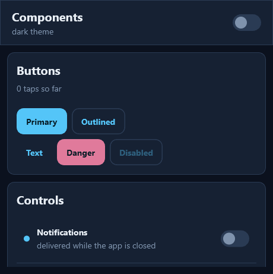
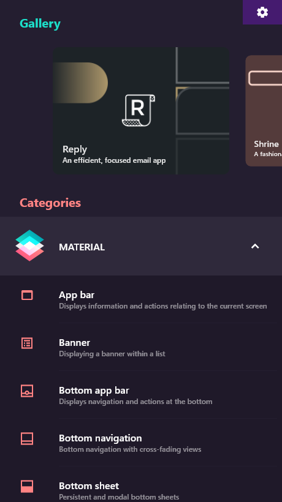
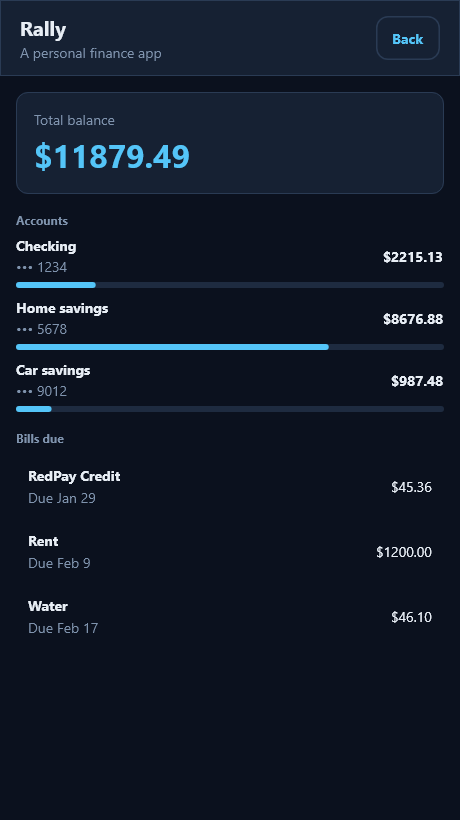
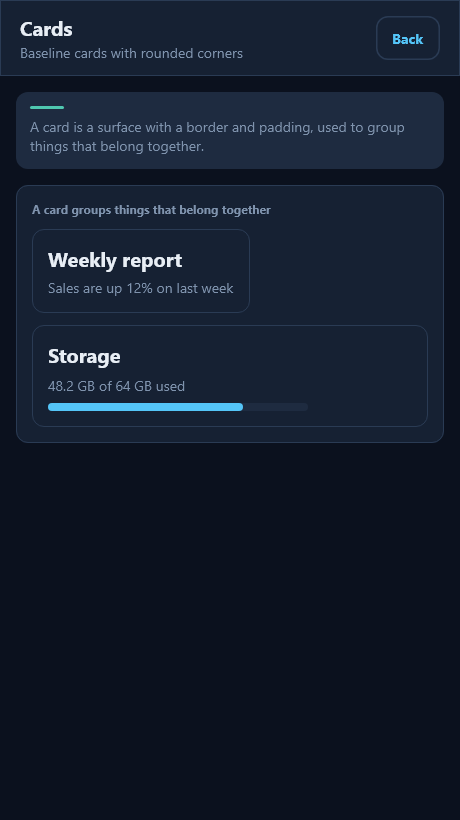
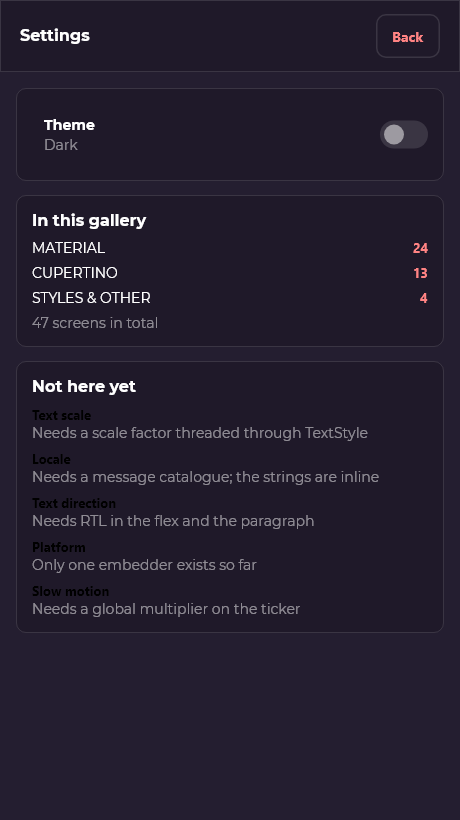
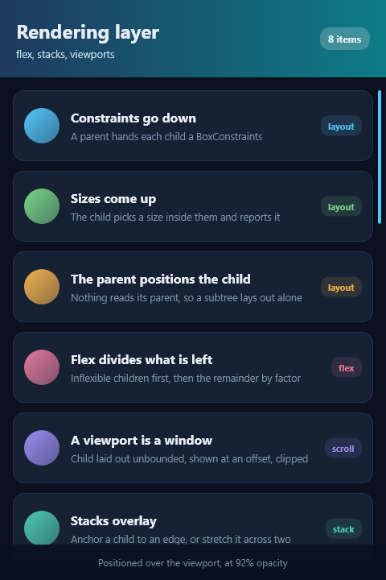
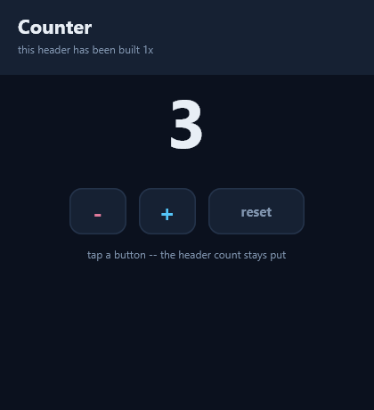
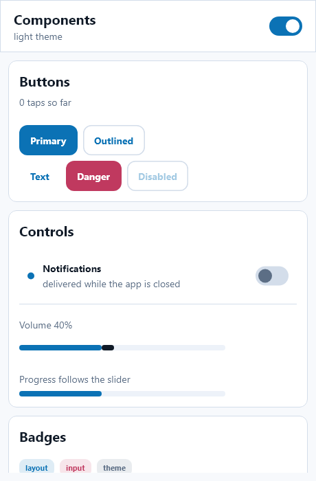

# rustflutter

[English](README.md) · **简体中文**

用 Rust 重写 Flutter 框架层，保留 Flutter engine 的排版、渲染、合成与线程模型。

- **保留**：Impeller（GPU 渲染）、display_list（绘制录制）、flow（Layer 树与合成）、
  txt + skparagraph（文字整形排版）、fml（线程模型 / TaskRunner / MessageLoop）、
  shell（Engine / Animator / Rasterizer / Pipeline）。
- **删除**：Dart VM、DartIsolate、tonic、`dart:ui` 的 Dart 侧、整个 `packages/flutter`。
- **重写**：框架层（gestures / animation / painting / rendering / widgets / 组件库）改用 Rust。

上游来源：[flutter/flutter](https://github.com/flutter/flutter)，commit `cf97bfbcb9f`。

> 本项目与 Google 及 Flutter 团队无隶属、无背书、无赞助关系。"Flutter" 是
> Google LLC 的商标，出现在这里只是为了说明本软件由什么构成。

## 当前状态

**M0–M7 完成，含 Impeller，Flutter Gallery 已移植。** 整个 shell 在无 Dart 的情况下
构建通过；应用跑在引擎自己的 Shell 上，有真正的线程模型、vsync 驱动的帧调度、
`Rasterizer` 流水线，以及 **Impeller GPU 渲染**（ANGLE 提供 GLES）；
框架层有完整的 RenderBox 协议、element 树与状态、命中测试与手势、
动画与导航栈，以及一套组件库。

```
gn gen                        →  1009 targets from 275 files
ninja                         →  exit 0，零警告
rustflutter_unittests         →  132 passed
flutter_gallery_unittests     →   21 passed
rust_ffi_unittests            →   15 passed
帧率（optimized 构建）         →  16.6–16.8 ms/帧（59.5–60.3 fps）
其中真正干活                   →  UI 线程 0.5 ms + 光栅 0.9 ms
```



*上图是从 GPU 帧缓冲回读的真实帧——Impeller 经 ANGLE 渲染。*

<p align="center">
  
  
  
  
</p>

*Flutter Gallery：首页、Rally、组件页、设置。26 个屏幕，全部由 Rust 排版。*

## 拉依赖

引擎的 C++ 和整个 Rust 框架都在仓库里，随克隆一起到。`third_party` 和构建工具链
不在——`DEPS` 声明它们，由 `gclient sync` 拉取。需要 `depot_tools` 在 PATH 上：

```sh
cp tools/gclient.template .gclient
gclient sync                  # 约 13 GB
python tools/check_deps.py    # 核对拉到的 revision 和 DEPS 是否一致
```

clang、gn、ninja、skia、icu、angle 都在里面。两件它不负责的事：

- **`rustc` 要自己装。** 它从 PATH 解析（见 `src/build/toolchain/rust.gni`），
  需要 edition 2024，本机验证于 1.93.0。
- **Windows 上要本机的 Visual Studio**，并设 `DEPOT_TOOLS_WIN_TOOLCHAIN=0`。
  否则 `win_toolchain` hook 会去取 Google 内部的工具链包。

## 快速开始

```sh
cd src

# 一次性：生成构建文件
vpython3 flutter/tools/gn --unoptimized --no-rbe
ninja -C out/host_debug_unopt

# 应用要链接的那个归档，以及创建一个应用
vpython3 flutter/tools/gn --runtime-mode=release --no-rbe
ninja -C out/host_release flutter/rust:rustflutter_engine
./out/host_debug_unopt/rustflutter create my_app --title "My App" --path ~/code
```

## 应用

**应用就是一个普通的 Cargo 工程，放在你想放的地方。**
它不是 GN target，也不属于本仓库：

```sh
cd ~/code/my_app
cargo run                    # 开窗口，帧由 vsync 驱动
cargo run -- --png out.png   # 无头单帧，不起 shell
cargo test
```

能这样是因为引擎构建会产出 `flutter/rust:rustflutter_engine`——
一个装着整个 C++ 侧的归档，生成的 `build.rs` 链接它。
Cargo 把框架 crate 和应用一起编译在它之上，所以应用完全不需要知道 GN 的存在。

必须是 **release** 引擎构建：一切都链接静态 CRT（`/MT`），
这也是 rustc 用的，而 debug 构建用的是 `/MTd`。

应用以前是 `flutter/rust/projects` 下的 GN target——因为引擎是 GN 构建的，
而应用必须链接引擎。那让每个应用都变成了引擎代码，而它不是：
无关工程进了引擎的构建图和 git 历史，每次引擎升级都得驮着它们。

## 应用长什么样

```rust
use rustflutter::prelude::*;

#[derive(Default)]
struct State {
    count: i32,
    pressed: Option<u64>,
}

struct Counter;

impl StatefulComponent for Counter {
    type State = State;

    fn build(
        &self,
        state: &State,
        handle: StateHandle<State>,
        _cx: &mut rustflutter::framework::BuildContext,
    ) -> AnyWidget {
        let count = state.count;
        stack_column(
            vec![
                component(Label::title(format!("{count}"))),
                component(
                    Button::new(1, "Increment")
                        .wired(handle, |s| &mut s.pressed, |s| s.count += 1),
                ),
            ],
            12.0,
        )
    }
}

struct App;

impl WidgetApplication for App {
    fn build(&mut self, _cx: &BuildContext) -> AnyWidget {
        provide(Theme::dark(), stateful(Counter))
    }
}

fn main() {
    register_application(|| Box::new(WidgetHost::new(App)));
    run(&RunOptions::default()).unwrap();
}
```

## 三层，和上游一样

```
Widget        廉价、不可变，每帧丢弃重建
Element       持久：持有状态，决定复用什么
RenderObject  做布局、绘制与命中测试
```

布局遵循与 Flutter `RenderBox` 相同的协议：**约束下行、尺寸上行、父级定位子级**。
`Text` 的整形排版走引擎自己的 `txt` / skparagraph，绘制进真实的 `DisplayList`。

每一帧的路径是引擎原本的那条：

```
VsyncWaiter → Animator → Engine → RuntimeController
    → Application::build → 布局 → 绘制 → LayerTree
    → Pipeline → Rasterizer → Surface → 屏幕
```

一次点击的路径是它的镜像：

```
Win32 → PlatformView → Engine → RuntimeController
    → 命中测试（对着上一帧的 render tree）→ 手势识别
    → set_state → 标脏 → 请求一帧
```

按键走同一条路，但从另一扇门进：它是 `flutter/keydata` 上的一条**平台消息**。
这是每个 Flutter embedder 的做法，所以 `PlatformView`、`Shell`、`Engine`
里没有任何一个键盘形状的方法：

```
Win32 → KeyDataPacket → PlatformView::DispatchPlatformMessage → Engine
    → RuntimeController → Application::on_key
```

还没有焦点树，所以按键没有可投递的对象。现在有的是上游在焦点遍历**之前**
跑的那一层——`FocusManager` 的 early key handler——也就是应用级快捷键，
诚实地说也只有这个。

帧是按需的，不是自由运行的：没有请求时引擎在最后一帧之后进入空闲，
所以一个静态界面留在屏幕上不花任何代价。

## 关键设计前提

整个方案成立的依据是一个实测结论：**引擎的渲染栈已经与 Dart 完全解耦**。
`flow`、`display_list`、`txt` 对 Dart 的引用数为 0，`impeller` 仅一个单测引用。
Dart 与引擎之间的全部契约收敛在两处：

| 方向 | 位置 | 规模 |
|---|---|---|
| Dart → C++ | `lib/ui/dart_ui.cc` 绑定表 | 231 个绑定 |
| C++ → Dart | `lib/ui/window/platform_configuration.h` 的 `DartPersistentValue` | 20 个回调 |

而真正的交接点只有一行（`runtime/runtime_delegate.h`，本仓库重建后原样保留）：

```cpp
virtual void Render(int64_t view_id,
                    std::unique_ptr<flutter::LayerTree> layer_tree,
                    float device_pixel_ratio) = 0;
```

框架层唯一的产出就是一棵 `LayerTree`。**Rust 只要能构造 `LayerTree`，
下游 rasterizer → display_list → Impeller 一行都不用改**。

## 示例

| 示例 | 证明了什么 |
|---|---|
| `hello_world` | 流水线端到端：Rust → DisplayList → LayerTree → 光栅化 |
| `gallery` | 渲染层：flex、stack、viewport 滚动、渐变、裁剪 |
| `counter` | element 树 + 局部重建 + 点击 |
| `showcase` | 组件库与主题：一次点击开关，整个应用换配色 |
| `flutter_gallery` | 上游 Gallery 的移植：26 个屏幕、导航栈、滑入过渡 |

<p align="center">
  
  
  
</p>

## Release 构建与分发

```
vpython3 flutter/tools/gn --runtime-mode=release --no-rbe
ninja -C out/host_release flutter/rust/examples/flutter_gallery
python3 tools/package_gallery.py --zip
```

产出 `dist/rustflutter-gallery/`：一个 20 MB 的 exe 加 `icudtl.dat`。
没有别的——字体、图标、study 插画、38 张商品照片全部 `include_bytes!` 进了
二进制，没有 asset bundle、没有 `flutter_assets` 目录、没有 CRT 运行库依赖
（导入表里全是系统 DLL，ANGLE 是静态链的）。

## 目录结构

```
src/
├── .gn, BUILD.gn, build/, build_overrides/   GN 构建系统（+ Rust 工具链）
└── flutter/
    ├── impeller/          GPU 渲染          ── 原样保留
    ├── display_list/      绘制录制/回放      ── 原样保留
    ├── flow/              Layer 树与合成     ── 原样保留
    ├── txt/               文字排版           ── 原样保留
    ├── fml/               线程模型           ── 原样保留（去 Dart Timeline）
    ├── shell/             壳层与平台嵌入      ── 已去 Dart 化
    ├── runtime/           RuntimeController   ── 重建：驱动 Rust 而非 isolate
    ├── lib/ui/            引擎对象包装层      ── :ui_types 可用，其余见 M4 的取舍
    └── rust/                                 ← Rust 侧
        ├── ffi/           C ABI + C++ 实现（78 个函数）
        ├── host/          窗口 + 线程模型 + Shell 启动
        ├── rustflutter/   框架 crate
        │   ├── engine.rs      引擎绑定
        │   ├── painting.rs    路径、渐变、图片、画布状态
        │   ├── render.rs      RenderBox 协议与渲染对象
        │   ├── widgets.rs     具名门面
        │   ├── framework.rs   Widget / Element / 状态 / Provider
        │   ├── gestures.rs    指针事件与手势识别
        │   ├── keyboard/      按键事件、键表、按下集合
        │   ├── components.rs  组件库与主题
        │   └── app.rs         与 shell 的契约
        ├── cli/           `rustflutter` 命令行工具
        └── examples/      示例应用
```

这里的 4,559 个引擎文件中，64 个改过，其余与上游逐字节相同。
逐目录分级、各里程碑的完整改动记录、以及下一步的优先级，
见 **[PORTING_STATUS.md](PORTING_STATUS.md)**。

## 已知限制

- **render tree 每帧整棵重建。** 元素复用保住了状态、跳过了 `build`，
  但布局和绘制照跑不误。这是最大的一笔性能欠账。
- **host 只有 Windows。** `rf_host_run` 之上的一切（Shell、ThreadHost、Animator、
  Rasterizer、软件 surface）都是可移植的，每个平台缺的只是一个窗口和一个消息循环。
- **layer 树是平的。** 框架每帧只产出一个 layer、一个 DisplayList：裁剪、
  透明度、变换都记在 display list 里，而不是像上游那样造出 `ClipRectLayer`、
  `OpacityLayer`、`TransformLayer`。后果是没有 repaint boundary、raster cache
  无从命中、damage 就是全屏。目前不构成瓶颈（光栅只要 1 ms），但场景变重时会。
  layer 的 FFI 都已经在，只是框架层还没用。
- **键盘只能上报，不能吃掉。** 按键送得到框架，`Application::on_key` 也会
  回答用没用，但没人拿这个答案做事：系统同样收到每一个键。要挡住一个没人
  处理的键，就得在框架回话之后把它重新 post 回消息队列——那是上游
  `KeyboardManager` 的大半。另外还没有焦点树，所以按键处理是应用级的，
  不是按控件的。
- **没有文本输入、平台通道、无障碍。** `flutter/keydata` 是解的；其余通道全丢。
- **不会有 hot reload。** Dart VM 的能力，Rust 没有对等物。

## 诊断开关

| 环境变量 | 作用 |
|---|---|
| `RUSTFLUTTER_SOFTWARE=1` | 强制 Skia 软件 surface，绕过 Impeller |
| `RUSTFLUTTER_CAPTURE_FRAME=<path>` | 在 swap 前回读 GPU 帧缓冲写 PNG，每帧覆盖。GPU 合成的窗口用 `PrintWindow` 抓不到，这是看 Impeller 究竟画了什么的办法 |
| `RUSTFLUTTER_FRAME_STATS=1` | 每 60 帧报一次 UI 线程分段（build / layout / 录制）与光栅侧（光栅 / swap / 帧间隔）的中位数。找出双重等待靠的就是它 |
| `RUSTFLUTTER_OUT=<dir>` | 让 CLI 使用指定的构建输出目录 |

## 许可

BSD-3-Clause，与 Flutter 相同——本仓库绝大部分是它的引擎，见 [LICENSE](LICENSE)。

Gallery 的部分素材是 Apache 2.0 而非 BSD，且被编译进了二进制，所以分发出去的
可执行文件也带着它们。哪些来自哪里，见 [NOTICE](NOTICE)。
